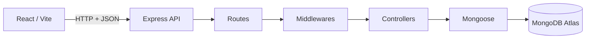
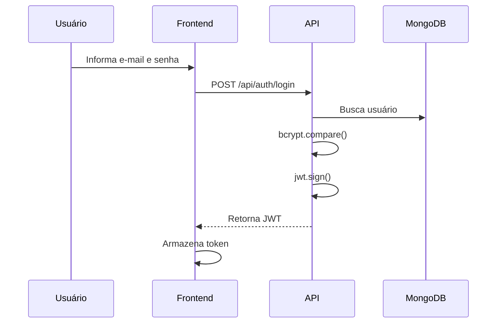
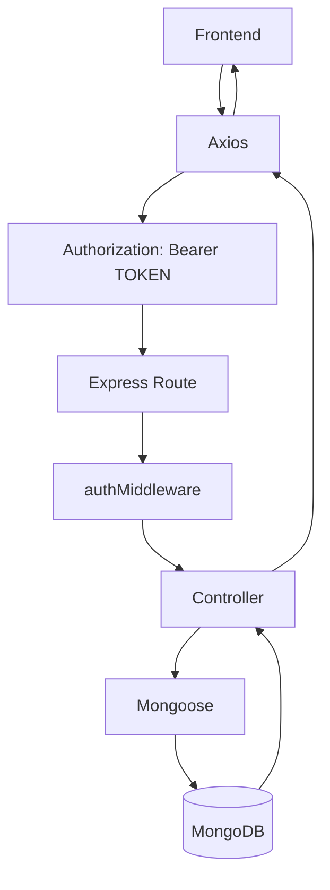
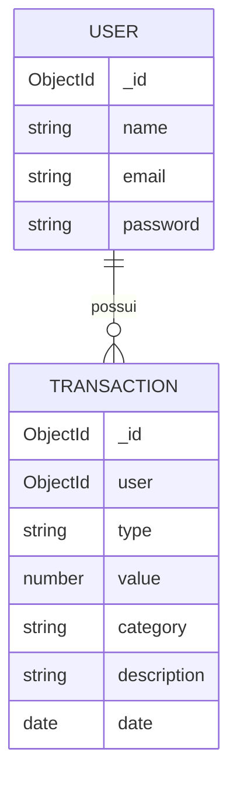
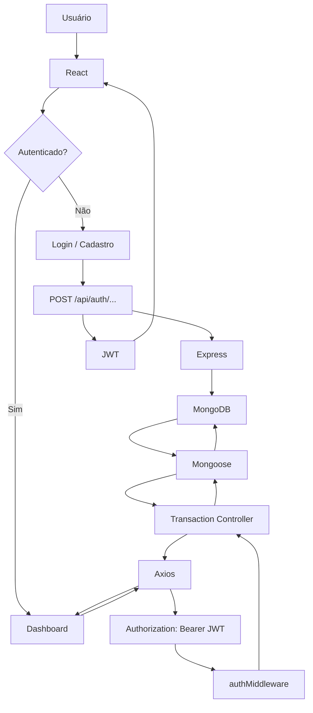

# 💰 Gerenciador Financeiro MERN

Aplicação web de **gestão financeira pessoal simples**, desenvolvida como projeto acadêmico utilizando a stack **MERN**.

O objetivo do sistema é permitir que usuários criem uma conta, façam login e organizem seus lançamentos financeiros de forma simples, mantendo as informações persistidas em banco de dados e protegidas por autenticação.

> **Status do projeto:** em desenvolvimento

---

## 📌 Sobre o projeto

O Gerenciador Financeiro MERN foi pensado para resolver uma necessidade prática: registrar e consultar movimentações financeiras sem transformar o controle financeiro em uma aplicação excessivamente complexa.

A proposta inicial é trabalhar com duas entidades principais:

* **Usuário**: responsável pela autenticação e propriedade dos dados.
* **Transação**: representa uma entrada ou saída financeira pertencente a um usuário.

O sistema utiliza autenticação baseada em **JWT**, armazenamento seguro de senhas com **bcrypt** e persistência em **MongoDB Atlas**.

---

## 🎯 Objetivos

* Criar e autenticar usuários.
* Armazenar senhas utilizando hash com bcrypt.
* Emitir e validar tokens JWT.
* Registrar entradas e saídas financeiras.
* Listar as transações do usuário autenticado.
* Editar transações existentes.
* Excluir transações.
* Integrar uma interface React a uma API REST desenvolvida em Node.js e Express.
* Aplicar organização por responsabilidades, separando rotas, controllers, models e middlewares.

---

## 🧩 Tecnologias utilizadas

| Tecnologia        | Finalidade                              |
| ----------------- | --------------------------------------- |
| **React**         | Interface do usuário                    |
| **Vite**          | Ambiente de desenvolvimento do frontend |
| **Axios**         | Comunicação entre frontend e API        |
| **Node.js**       | Ambiente de execução do backend         |
| **Express**       | Servidor HTTP e API REST                |
| **MongoDB Atlas** | Banco de dados em nuvem                 |
| **Mongoose**      | Modelagem e acesso ao MongoDB           |
| **bcrypt**        | Hash de senhas                          |
| **jsonwebtoken**  | Autenticação com JWT                    |
| **cors**          | Controle de comunicação entre origens   |
| **dotenv**        | Variáveis de ambiente                   |
| **Git / GitHub**  | Controle de versão e colaboração        |
| **Postman**       | Testes da API                           |

> Docker pode ser adicionado posteriormente como diferencial de empacotamento.

---

## 🏗️ Arquitetura

A aplicação segue uma arquitetura em camadas, separando apresentação, API, regras de negócio e persistência.



### Fluxo de autenticação



### Fluxo de uma transação protegida



---

## 📂 Estrutura do projeto

```text
gerenciador-de-tarefas-mern/
├── backend/
│   ├── src/
│   │   ├── controllers/
│   │   │   ├── authController.js
│   │   │   └── transactionController.js
│   │   ├── models/
│   │   │   ├── User.js
│   │   │   └── Transaction.js
│   │   ├── routes/
│   │   │   ├── authRoutes.js
│   │   │   └── transactionRoutes.js
│   │   ├── middlewares/
│   │   │   ├── authMiddleware.js
│   │   │   └── errorMiddleware.js
│   │   └── server.js
│   ├── .env
│   ├── .env.example
│   ├── .gitignore
│   ├── package.json
│   └── package-lock.json
│
├── frontend/
│   ├── src/
│   │   ├── components/
│   │   ├── context/
│   │   ├── pages/
│   │   ├── services/
│   │   └── App.jsx
│   ├── package.json
│   └── package-lock.json
│
├── LICENSE
└── README.md
```

---

## 🗃️ Modelo de dados

### Usuário

```text
User
├── _id
├── name
├── email
└── password
```

A senha é armazenada como hash utilizando bcrypt e não em texto puro.

### Transação

```text
Transaction
├── _id
├── user      → referência ao User
├── type      → entrada | saida
├── value
├── category
├── description
└── date
```

### Relacionamento



Um usuário pode possuir várias transações, enquanto cada transação pertence a um único usuário.

---

## 🔐 Autenticação e segurança

O sistema utiliza diferentes camadas de proteção:

### Senhas

No cadastro, a senha recebida pela API passa por `bcrypt.hash()` antes de ser armazenada.

### JWT

No login, após validar as credenciais, a API gera um token JWT. Esse token é utilizado nas rotas protegidas.

### Middleware de autenticação

As rotas de transações utilizam um middleware que:

1. lê o cabeçalho `Authorization`;
2. extrai o Bearer Token;
3. valida o JWT com `jwt.verify()`;
4. disponibiliza o ID do usuário em `req.userId`;
5. permite o processamento da requisição somente quando a autenticação é válida.

### CORS

O backend utiliza CORS para permitir a comunicação entre frontend e backend em origens diferentes durante o desenvolvimento.

### Variáveis de ambiente

Informações sensíveis, como a URI do MongoDB e o segredo do JWT, devem permanecer no `.env` e nunca serem versionadas.

---

## ⚙️ Configuração do ambiente

### Pré-requisitos

* Node.js instalado
* Git instalado
* MongoDB Atlas configurado
* Postman para testes da API (opcional, mas recomendado)

### 1. Clone o repositório

```bash
git clone https://github.com/pedro-henriqueholanda/gerenciador-de-tarefas-mern.git
cd gerenciador-de-tarefas-mern
```

### 2. Configure o backend

```bash
cd backend
npm install
```

Crie um arquivo `.env` a partir do `.env.example`:

```env
PORT=3000
MONGO_URI=sua_connection_string_do_mongodb
JWT_SECRET=seu_segredo_jwt
```

> Nunca publique os valores reais de `MONGO_URI` ou `JWT_SECRET`.

### 3. Inicie o backend

```bash
node src/server.js
```

Quando a configuração estiver correta, o terminal deverá apresentar mensagens semelhantes a:

```text
MongoDB conectado!
Servidor rodando na porta 3000
```

### 4. Configure o frontend

Em outro terminal:

```bash
cd frontend
npm install
npm run dev
```

Caso o projeto utilize um arquivo de ambiente para a URL da API, configure a variável `VITE_API_URL` conforme o ambiente local.

Exemplo:

```env
VITE_API_URL=http://localhost:3000/api
```

---

## 🔌 API REST

### Autenticação

| Método | Endpoint             | Acesso  | Função                         |
| ------ | -------------------- | ------- | ------------------------------ |
| `POST` | `/api/auth/register` | Público | Cadastrar usuário              |
| `POST` | `/api/auth/login`    | Público | Autenticar usuário e gerar JWT |

### Transações

Todas as rotas abaixo exigem autenticação via Bearer Token.

| Método   | Endpoint                | Função                       |
| -------- | ----------------------- | ---------------------------- |
| `POST`   | `/api/transactions`     | Criar transação              |
| `GET`    | `/api/transactions`     | Listar transações do usuário |
| `GET`    | `/api/transactions/:id` | Buscar uma transação         |
| `PUT`    | `/api/transactions/:id` | Atualizar transação          |
| `DELETE` | `/api/transactions/:id` | Excluir transação            |

---

## 🧪 Exemplos de requisições

### Cadastro

```http
POST /api/auth/register
Content-Type: application/json
```

```json
{
  "name": "Usuário Teste",
  "email": "usuario@teste.com",
  "password": "123456"
}
```

### Login

```http
POST /api/auth/login
Content-Type: application/json
```

```json
{
  "email": "usuario@teste.com",
  "password": "123456"
}
```

Resposta esperada:

```json
{
  "token": "JWT_GERADO_PELO_BACKEND"
}
```

### Criar transação

```http
POST /api/transactions
Authorization: Bearer SEU_TOKEN
Content-Type: application/json
```

```json
{
  "type": "entrada",
  "value": 1500,
  "category": "Salário",
  "description": "Pagamento",
  "date": "2026-09-10"
}
```

### Atualizar transação

```http
PUT /api/transactions/ID_DA_TRANSACAO
Authorization: Bearer SEU_TOKEN
Content-Type: application/json
```

```json
{
  "type": "saida",
  "value": 500,
  "category": "Alimentação",
  "description": "Mercado",
  "date": "2026-09-10"
}
```

### Excluir transação

```http
DELETE /api/transactions/ID_DA_TRANSACAO
Authorization: Bearer SEU_TOKEN
```

---

## 🧪 Testes da API com Postman

O backend foi desenvolvido para ser validado inicialmente de forma independente do frontend.

Fluxo recomendado de testes:

```text
Cadastro
   ↓
Login
   ↓
Obter JWT
   ↓
Criar transação
   ↓
Listar transações
   ↓
Buscar por ID
   ↓
Atualizar
   ↓
Excluir
```

Para rotas protegidas, utilize no Postman:

```text
Authorization
→ Type: Bearer Token
→ Token: SEU_JWT
```

---

## 🖥️ Frontend

O frontend utiliza React e organiza a aplicação em páginas, componentes, contexto de autenticação e camada de comunicação com a API.

### Principais responsabilidades

* **Login:** autenticação do usuário e recebimento do JWT.
* **Cadastro:** criação de novos usuários.
* **Dashboard:** visualização e gerenciamento das transações.
* **AuthContext:** gerenciamento global da autenticação.
* **api.js:** instância do Axios e inclusão automática do JWT nas requisições.

### Comunicação com a API

O Axios utiliza uma variável de ambiente para definir a URL base da API e um interceptor para adicionar automaticamente:

```http
Authorization: Bearer SEU_TOKEN
```

Esse mecanismo evita repetir a lógica de autenticação em cada chamada HTTP.

---

## 🔄 Fluxo completo da aplicação



---

## 🛡️ Boas práticas adotadas

* Separação de responsabilidades entre routes, controllers, models e middlewares.
* Uso de variáveis de ambiente para configurações sensíveis.
* Senhas armazenadas com hash.
* Rotas de transações protegidas por JWT.
* Relação explícita entre transações e usuários.
* Validações no schema Mongoose.
* Uso de CORS.
* Testes da API independentes do frontend.
* Controle de versão com Git e branches por funcionalidade/correção.

---

## 🐛 Problemas comuns

### MongoDB Atlas não conecta

Verifique:

* se `MONGO_URI` está correta;
* se o cluster está ativo;
* se o usuário do banco possui as permissões necessárias;
* se o IP atual está autorizado na **IP Access List** do Atlas;
* se a rede atual consegue resolver os registros DNS/SRV utilizados pelo `mongodb+srv`.

Em ambientes institucionais, redes ou DNS podem interferir na resolução do host do MongoDB Atlas.

### API não responde em `localhost`

Confirme se o backend está em execução e se a porta configurada em `PORT` corresponde à URL usada pelo frontend.

### Erro de autenticação

Confirme se:

```text
Authorization: Bearer SEU_TOKEN
```

está sendo enviado e se o token ainda é válido.

---

## 🌿 Controle de versão

O projeto utiliza GitHub para colaboração entre os integrantes.

Fluxo recomendado:

```text
main
 ├── feat/...
 ├── fix/...
 └── chore/...
```

Cada alteração relevante deve ser desenvolvida em uma branch própria, testada e enviada por Pull Request antes de ser incorporada à branch principal.

---

## 👥 Integrantes

* Pedro Henrique Holanda
* Antonio Guilherme Viana Silva

---

## 📚 Contexto acadêmico

Projeto desenvolvido para a disciplina de Desenvolvimento Web, aplicando conceitos de:

* desenvolvimento de API REST;
* integração entre frontend e backend;
* autenticação e autorização;
* persistência em banco de dados;
* arquitetura em camadas;
* segurança básica de aplicações web;
* controle de versão e colaboração com Git/GitHub.

---

## 📄 Licença

Consulte o arquivo `LICENSE` presente na raiz do repositório.

---

## 🚀 Próximas etapas

* Finalizar a integração do frontend com as rotas de transações.
* Validar o fluxo completo Frontend → API → MongoDB.
* Revisar validações de entrada e tratamento de erros.
* Executar testes finais de autenticação e CRUD.
* Finalizar documentação e preparação para apresentação.
* Avaliar Docker como diferencial de entrega.
